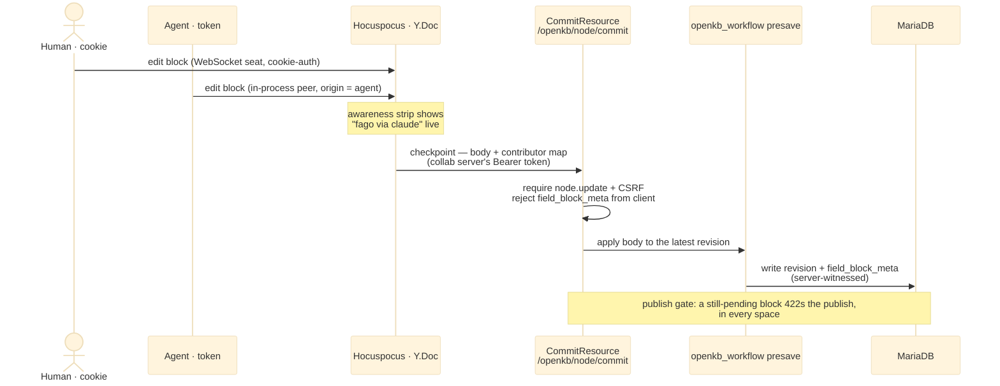

# Architecture

OpenKB is a decoupled system: a **Nuxt 4 frontend** (with an embedded collaboration
server) in front of a **Drupal 11 backend** that owns content, access and attribution.
The protocol between them is Markdown; Drupal is storage and the sole authority for
gate data.

This page is the map. Deep dives: [collab-server.md](collab-server.md) (Hocuspocus,
the two-credential checkpoint) and [space-access.md](space-access.md) (roster → grants).

## System topology

Each tier owns its own store; every edge names its **caller, endpoint and credential**
(blue = session cookie, violet = agent Bearer token, red = the checkpoint carrying the
collab server's own OAuth token; **green boxes = the custom `/openkb/*` endpoints**, blue = core surfaces). The two frontend boxes share one process (`frontend`) —
the Nitro API joins agents into the collab server's Y.Doc in-process.

```mermaid
%%{init: {'theme':'base','themeVariables':{'edgeLabelBackground':'#ffffff'}}}%%
flowchart LR
  subgraph BG [" "]
  direction LR
  H["Human<br/>editor · reader"]:::actor
  AG["AI agent<br/>MCP client"]:::actor
  IDB[("Browser IndexedDB<br/>offline CRDT mirror")]:::store

  subgraph NUXT["Frontend · frontend — Nuxt 4 app + Nitro API"]
    direction TB
    APP["Nuxt app<br/>read pages · TipTap editor · AI chat"]:::svc
    CAPI["Content API<br/>/api/kb · /api/node/:id<br/>commit · publish"]:::svc
    AAPI["Agent surface<br/>/api/mcp · /api/agent/edit<br/>/api/kb/:space/:slug/draft.md"]:::svc
  end
  subgraph COLLAB["Frontend · frontend — collab server (embedded Hocuspocus)"]
    direction TB
    HP["Hocuspocus<br/>Y.js · WebSocket · awareness"]:::svc
    SQ[("hocuspocus.sqlite<br/>Y.Doc snapshots")]:::store
  end

  subgraph DR["Drupal 11 · drupal — custom endpoints (openkb modules) + core surfaces"]
    direction TB
    CMT["POST /openkb/node/{123}/commit<br/>the ONE write door for documents<br/>node.update + CSRF · latest revision"]:::custom
    EDT["editor support<br/>GET /openkb/node/{123}/moderation<br/>POST /openkb/node/{123}/space<br/>PUT /openkb/space/{4}/outline<br/>GET /openkb/schema"]:::custom
    IDN["GET /openkb/agent/identity<br/>who does this token act as"]:::custom
    JAPI["core: JSON:API + /ce-api/*<br/>entities · CE markup for SSR<br/>field_block_meta edit: DENIED"]:::svc
    MODS["openkb modules<br/>attribution presave · publish gate<br/>space access · AI/RAG"]:::svc
    MDB[("MariaDB<br/>nodes · revisions<br/>field_block_meta")]:::store
    OSS[("OpenSearch<br/>full-text · k-NN in progress")]:::store
  end

  HP --- SQ
  CMT --- MODS
  JAPI --- MODS
  EDT --- MODS
  IDN --- MODS
  MODS --- MDB
  MODS --- OSS

  H ==>|"browser: GET pages<br/>HTTPS · session cookie"| APP
  H ==>|"browser: WS /collaboration<br/>session cookie only (token refused)"| HP
  H -. "browser keeps<br/>offline mirror" .- IDB
  AG ==>|"agent calls: POST /api/mcp<br/>draft.md PUT · Bearer token"| AAPI

  APP ==>|"browser: /api calls<br/>cookie + CSRF"| CAPI
  AAPI ==>|"Nitro joins the agent<br/>into the Y.Doc in-process"| HP

  CAPI ==>|"Nitro relays save / publish → node/{123}/commit<br/>user's cookie + CSRF"| CMT
  CAPI ==>|"editor chrome → node/{123}/moderation · space<br/>schema · cookie"| EDT
  HP ==>|"collab server checkpoints → node/{123}/commit<br/>its own OAuth Bearer token"| CMT
  AAPI ==>|"agent write → node/{123}/commit<br/>agent's Bearer token"| CMT
  AAPI ==>|"acting account → /agent/identity<br/>agent's Bearer token"| IDN
  APP ==>|"SSR markup + entities → /ce-api · JSON:API<br/>user's cookie or anonymous"| JAPI
  end

  classDef actor fill:#ede9fe,stroke:#7c3aed,color:#1e1b4b
  classDef svc fill:#e0f2fe,stroke:#0369a1,color:#082f49
  classDef custom fill:#dcfce7,stroke:#15803d,color:#052e16
  classDef store fill:#fef3c7,stroke:#b45309,color:#451a03
  style BG fill:#ffffff,stroke:#ffffff
  style NUXT fill:#f0f9ff,stroke:#0369a1,stroke-width:2px
  style COLLAB fill:#e0f2fe,stroke:#0284c7,stroke-width:2px
  style DR fill:#f0fdf4,stroke:#15803d,stroke-width:2px
  linkStyle 8,9,12,14,15,16,20 stroke:#1d4ed8,stroke-width:2px
  linkStyle 11,13,18,19 stroke:#7c3aed,stroke-width:2px
  linkStyle 17 stroke:#be123c,stroke-width:2.5px
```

## Actors & authentication

| Actor | Carrier | Reaches | Notes |
|---|---|---|---|
| **Human editor / reader** | HttpOnly **session cookie** | Nuxt app, Hocuspocus WebSocket, all `/api/*` | The only credential the collab socket accepts — see [Trust boundaries](#trust-boundaries). |
| **AI agent** | OAuth **Bearer token** carrying an agent scope, issued for a human owner | `/api/mcp`, the `.md` PUT | Reads as **"fago via claude"** wherever it is named — the page, the assignee picker, the revision log — the same for every reader. Permissions = owner ∩ scope; admin owners refused. |
| **Anonymous reader** | none | read pages, public search | Space read access + node grants decide what is served. |

## API surface

| Endpoint | On | Who | Purpose |
|---|---|---|---|
| `WebSocket /collaboration` | Nitro (Hocuspocus) | human | Live Y.js session; `onAuthenticate` takes the cookie only. |
| `/api/mcp` | Nitro | agent | MCP tools: read, search, block-level edit, plus Drupal's own relayed from `/mcp`. |
| `/api/agent/edit` | Nitro | agent | Routes an agent edit into the Y.Doc session, which owns persisting it. |
| `/api/kb/<space>/<slug>` · `/draft.md` | Nitro | human · agent | Read the page as Markdown (GET); the draft PUT is agent-only. |
| `/api/node/{id}/commit` → `POST /openkb/node/{123}/commit` | Nitro → Drupal | checkpoint | Writes the document to the **latest** revision (`CommitResource`). |
| `/api/node/{id}/publish` | Nitro → Drupal | editor | Refused with a machine-readable **422** if any block is still pending. |
| `POST /mcp` | Drupal (`mcp_server`) | agent · Nitro | Drupal's MCP endpoint — the tools whose logic is Drupal's (ADR 0009). |
| `GET /openkb/spaces` | Drupal | human · agent | Where the caller may work and at what level, self-scoped (`docs/space-access.md`). |
| `/api/spaces/<slug>/outline` → `PUT /openkb/space/{4}/outline` | Nitro → Drupal | editor | Replaces a space's page tree under compare-and-swap; gated on restructuring the space, not on administering it (`docs/space-access.md`). |
| `/api/chat` | Nitro → Drupal AI | human | Chat answer, streamed; permission-aware RAG grounding on the chunk index. Calls the same Drupal tool plugins `/mcp` serves, gated per account (`docs/ai-chat.md`). |
| `/api/drupal-ce/*`, `/ce-api/*` | Nitro → Drupal | reader | Custom-Elements markup for server-rendered read pages, and every page read by nid: `/ce-api/node/{nid}` the live revision, `…/latest` the working copy, `…/revisions/{vid}/view` one revision (`docs/space-access.md`). |
| `JSON:API` | Drupal | Nitro | Entity write, plus the reads no other route answers (spaces, outline, link resolution). `field_block_meta` edit is **denied**. |

### Addressable blocks

Blocks are addressable by fragment: the comark tree carries every top-level
block with the `id="b-…"` it round-trips, so `/<space>/<slug>#b-<id>` names one
block of one page. The id is minted rather than derived from the text, so the
address survives every rewrite of the block; deleting one, or splitting one
(which re-mints one side), breaks a link to it. The read page renders a ¶ anchor
into each block's margin server-side, `scroll-margin-top` keeps the sticky header
off the landing block, and `:target` marks arrival. Only the document's direct
children are id-bearing, so a link never addresses something inside a block — a
list item, a table cell — and a container block (list, table, code fence) carries
its id but no anchor: an `<a>` is no valid child of a `<ul>`.

## Collaborative write & attribution

Two peers — a human on the WebSocket and an agent joined in-process — edit **one**
Y.Doc. A checkpoint commits it to Drupal, where attribution is written **server-side**
from what the session witnessed, never from the request payload.



## Data stores

| Store | Owned by | Holds | Authority for |
|---|---|---|---|
| **MariaDB** | Drupal | nodes, revisions, moderation, the `field_block_meta` sidecar, spaces | Content & attribution *at rest* |
| **OpenSearch** | Drupal | `kb_chunks`: one row per section, text and vector together (`ai_search` + `ai_vdb_provider_opensearch`, `openkb_search` README) | Hybrid search; RAG retrieval and block-level citations |
| **hocuspocus.sqlite** | Collab server | Y.Doc CRDT snapshots | The document *while editing* |
| **Browser IndexedDB** | Client | per-tab offline CRDT mirror (`y-indexeddb`) | Offline edits until reconnect |

## Search index

One index, `kb_chunks`: one row per section of a published page, the section's
text and its vector together. Three reads answer off it — a query on both
arms, a title prefix on the lexical arm alone (the `[[` picker's offers and
the search box's suggest, which embed nothing), and the RAG retrieval behind
the chat and the `search_pages` tool.

The search page's empty query touches no index at all: `GET /openkb/search`
with no `q` lists the newest published pages off an entity query, sorted by
`changed`, scoped by the node grants the space roster writes.

**Values are stored as they were written.** No index processor rewrites
`title` or the section text, so a hit's title is the page's title and its
excerpt is the page's text. Nothing is loaded from an entity to render a hit.

**Matching is the analyzer's job.** Every `text` field is read with one
language-agnostic analyzer (`openkb_search`'s `openkb_text`): the standard
tokenizer, `lowercase`, `asciifolding`. So a lower-case query finds a
capitalised title, `Uber` finds `Über` and `eleve` finds `élève`. Nothing
beyond that — no stemmer, no decompounder, no stopword list, no synonyms.

**Language-specific analysis is project configuration.** A project that wants
it declares an analyser plugin and maps its fields onto it through
`search_api_opensearch`'s `FieldMappingEvent`, the same seam `openkb_text` uses.
LDP's `GermanLanguage` analyser is the worked example.

## Chunk index

The `kb_chunks` index on the same cluster: one row per section of a published
page, the section stored as analyzed text beside its vector, the row carrying
the block a citation lands on. `openkb_search`'s README holds the layer
contracts; what matters here is where the work sits.

**The sections are the sidecar's.** It parses the markdown for the read page
anyway, and only a parsed tree knows where a section ends and which block a
citation should anchor to. `POST /api/comark/indexable` answers them, cut to
the token target and cap Drupal names in `openkb_search.settings`, a token
estimated as four characters. No chunk ever exceeds the cap: an oversized
block is split inside, its parts sharing the block id.

**Drupal embeds, it does not chunk.** `comark_sections` reads the sections out
of the `chunks` field, embeds one vector each behind the heading path they sit
under, and stores the page's attributes in every row, so a hit needs no entity
load. Which attributes those are is `search_api.index.kb_chunks`: the address
a citation needs, and the frontmatter the `node.kb_page.frontmatter` form
display exposes — a keyword for what is filtered or shown, analyzed text for
what the lexical clause matches in, a date for what is sorted. A reference is
carried as its label, so a row names a person or a tag without loading one.

**A row says what its section references.** `cites` holds the sources the
section's blocks cite and `links` the pages they link to, both read off the
same parsed tree the sections come from. An edge names a page as `"42"` and
one of its blocks as `"42#b-4f2a"`, so one term answers "what references this
page" and one "what references this block"; a citation of a source outside the
knowledge base is no edge. A row carries its own section's edges, so a search
narrowed by one answers with the sections that hold it.

**What a chunk embeds is index config, not code.** `ai_search.index.kb_chunks`
marks each field Main Content, Contextual Content or Filterable Attributes. A
Contextual Content field goes in front of every chunk's embedded text as one
`<label>: <value>` line, so a section is found by what its page is as well as
by what the section says; `type` is marked that way. The stored `content` and
the highlights stay the section's own text, and the field is stored on the row
as well, so the filter reads it either way. Adding a frontmatter field to the
prefix is that one option, and every embedding text changes when it does.

**Embeddings are cached under the text that produced them.** Every provider
call runs through drupal/ai's request event, where a known text is answered
from a key-value cache before the provider is reached, so re-indexing an
unchanged section is free. `drush openkb:embeddings-export` /
`openkb:embeddings-import` move that cache to and from a fixture.

**One read path, three consumers.** `ChunkRetrieval` (`openkb_search`) is the
only query on the index: the chat grounds on it through the `ai_search_chunks`
retriever, `tool_api__search_pages` answers its hits over MCP, and the search
page reads it through `GET /openkb/search`. It embeds the question at the
server's own dimension and hands the vector down, runs under
`search_api_bypass_access` so no page is loaded, and is scoped by
`space_access_filter` alone.

**The reverse lookup is a retrieval option.** `cites` and `links` narrow a
search to the sections referencing a page or one of its blocks, and a hit
carries its own `cites`, so an answer grounded on a section can say what that
section was itself derived from. There is no second store and nothing to keep
in step: the edges are read off the body on every index run.

**Every keyword attribute narrows the same way.** A retrieval option names an
index field and narrows on it, so the three consumers filter identically and
an option naming no keyword attribute is refused rather than ignored. `type`
is the one exposed so far: `GET /openkb/search?type=`, read off the route like
`space` and answered 422 for a value the frontmatter schema does not list, and
an optional `type` argument on `tool_api__search_pages`. `tags`, `owner` and
`contributors` are reachable by the same option without further code.

**The search page collapses sections to pages.** `retrievePages()` groups the
hits by page, ranks each page by its best section and keeps the rest beside it,
which is what a row shows: one page, the best section as the excerpt and as the
link's anchor, the others as sub-links. Ranking is the best chunk's score, so
two query words in two sections of one page do not meet and repeated matches do
not add up. A search has no result count: the collapse runs after the chunk
fetch, so only the fetched window is known, and the answer says whether a
further one follows. The fetch widens until the window asked for is full or
the chunk cap is reached.

**Ranking is hybrid: kNN plus match, fused by the search pipeline.** One
OpenSearch request carries both clauses — a `knn` clause on the section vector
and a `match` clause on the section text, each bounded by the same access
filter — and a search pipeline normalises the two score lists and combines
them as a weighted arithmetic mean (`ai_vdb_provider_opensearch.settings`,
0.5 / 0.5 by default). So a term a section spells out is reachable whether or
not the embedding places the question near it, and the lexical clause hands
back the fragments it matched in, which the search page marks its excerpt with.
The match clause carries the parsed keys' conjunction, `AND` by Search API's
default, so a section answers only when it holds every word of the query. A
key the query excludes — `-word` — is a filter rather than a clause: it bounds
both arms as the access filter does, and it is left out of the text the vector
arm embeds.

**Relevance is gated on the vector clause.** The pipeline normalises each
clause against its own result set, so the fused score ranks the answer but
measures nothing: the best hit of any search is 1.0, an off-topic one
included. The floor therefore sits on the kNN clause, as
`openkb_search.settings`' `vector_floor`, on the scale OpenSearch scores the
collection's metric — `(1 + cosine) / 2` for cosine similarity. The lexical
clause needs no floor of its own: it answers only rows carrying every one of
the query's terms. The lexical index's boosts do not exist on the chunk index.
A question neither clause answers is the page's "nothing matches": the search
page says nothing is about it rather than showing the nearest row. A query the
provider's content guard refuses is the same state: no page matches those
words, and the answer says so rather than offering a retry.

**A field's mapping is fixed when the collection is created.** The collection
is created when the server's config is saved, before the index's own config
exists, so which fields are analyzed text is named in
`CollectionMappingSubscriber` rather than read off `field_settings`; every
other field is a keyword, which is what a `term` filter matches. Re-applying
`openkb_recipe_main` recreates nothing: the recipe imports no config that
already exists and calls nothing on the provider, so a mapping change reaches
an environment through a reinstall, not an update. The two fused-score gates
(`ai_search_score_threshold` on `search_api.index.kb_chunks`, `score_gate` on
the assistant) measure nothing; `openkb_recipe_ci` clears each with a config
action, so CI environments are covered.

**An alias that moves re-indexes its page.** The index carries the alias as
`path`, and an alias saved on its own changes no node, so `openkb_search`'s
`KbPageAliasHooks` marks the page for re-indexing whenever a
`path_alias` is saved or deleted — both ends of a move, since the page that
lost an alias falls back to its system path.

**The index ships enabled everywhere.** Every item it tracks is embedded at
save time: from the committed fixture wherever it holds the text at that
provider, model and dimension, and through the engine for the rest. An
environment with no `OPENAI_API_KEY` applies `openkb_recipe_embeddings_mock`,
which points the server's `embeddings_engine` at a keyless provider.

## Type-ahead offers

Two surfaces offer pages while someone types: the `[[` document-link picker in
the editor, and the suggest under the search box. Both are the same pattern —
an **ARIA combobox laid over the app's own input**, not a component that owns
one.

The input keeps `role="combobox"` and `aria-autocomplete="list"`, the offers
render as a `<ul role="listbox">` beside it, and the highlighted row is named
by `aria-activedescendant`. Nothing is preselected: Enter on the bare box does
the input's own thing — submit the search, or leave the `[[` text as typed —
and only an arrow key selects a row.

That is what the pattern buys: focus never leaves the field the shortcut
targets (`⌘K` for the search box, the editor selection for the picker), and
the keyboard reads the list without the field losing the caret. Nuxt UI's
`UCommandPalette` and `UInputMenu` each render an input of their own and
highlight the first row, so neither can hold either constraint.

## Trust boundaries

The rules that keep attribution unforgeable and publishing gated:

- **Identity on the collab socket is derived, never declared.** `onAuthenticate` takes the
  HttpOnly cookie and **refuses a `token`**: the socket seats only writers this server
  derived an identity for. This is a rule about *credentials*, not about agents — an agent
  is a full CRDT peer, joined **in-process** (`openDirectConnection`, no handshake), admitted
  by the session router and attributed like anyone else (ADR 0003).
- **The review sidecar is write-dead to clients.** `field_block_meta` `edit` access is
  `forbidden` on every path; Drupal writes it itself, in presave and when it applies the
  sign-offs a checkpoint states.
- **Attribution is a witnessed fact.** Who wrote which block rides the checkpoint, and Drupal
  reads it only over the collaboration server's own OAuth connection — a token carrying the
  **`collab`** scope (ADR 0001). A cookie holds no scope, so no browser save can claim it,
  whatever permissions the account behind it has. For everyone else, ordinary-write semantics
  credit the writer: a client can never *declare* authorship.
- **Four-eyes and the publish gate are server-decided.** A writer cannot clear their own block;
  publishing with a pending block returns a machine-readable 422, in every space. A Save is a
  draft revision and is never refused for it. Nothing publishes on its own — the whole model in
  one page: [editing-and-review.md](editing-and-review.md).
- **Agents write block-level, not whole-body**, so an agent cannot silently touch a block a
  human is typing or re-open a signed-off one.
- **A link to another page is resolved per reader, never for everyone.** The stored form is
  the target's identity (`:doc[Label]{nid="42"}`, optionally a block id); the address is
  worked out in the CE render of the body, under that reader's own carrier. A reader who may
  read the target gets its live title and its alias. A reader who may not gets the author's
  stored label and `/node/<nid>`, which Drupal answers 404 for. A deleted target renders the
  same way, so the two cases are indistinguishable. A link into one block keeps the stored
  label as its words and carries the live page title as its tooltip. Access is not enforced
  twice: the resolver is a JSON:API collection read, already filtered to the spaces the
  session may read.
- **A block names the source it was derived from, in the body.** A citation is the inline
  component `:citation{nid="42" block="b-4f2a" v="…"}` — or `:citation{url="…"}` for a source
  outside the knowledge base — resolved in the same CE render as `:doc[…]`, under the same
  carrier.
  `v` is the cited block's canonical-markdown version, so a read says whether the citation is
  still about the text it was made against: equal is live, different is stale, a block or page
  that does not resolve is dangling. The number a reader sees is handed out in that render and
  is never stored. Each block's own sources are read back off its own subtree and listed on
  its ℹ card.
